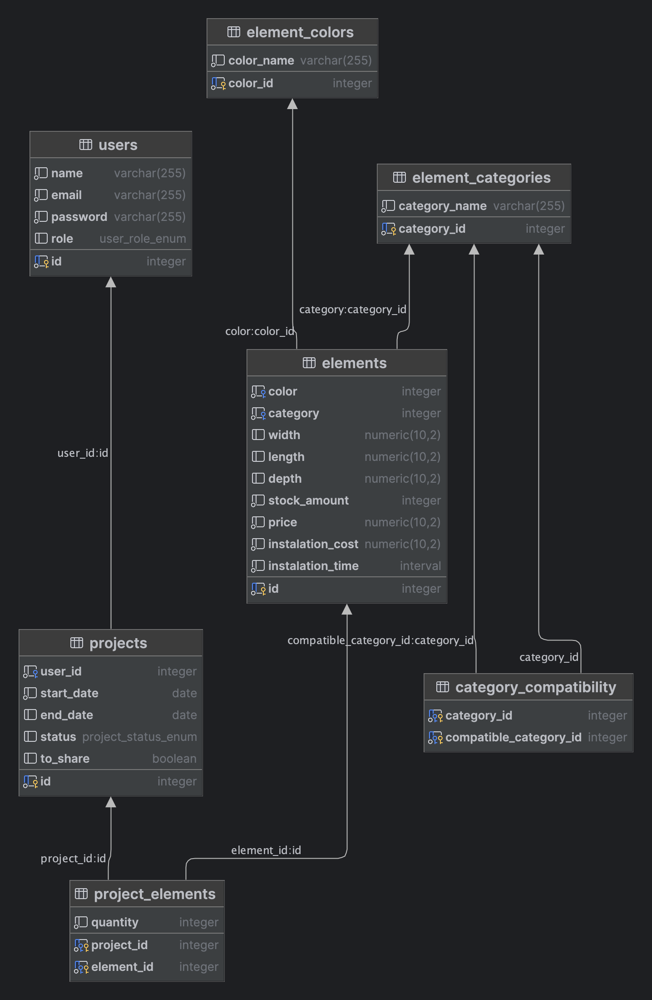

[Back to Main README](../README.md)
# Furnishcraft Database Documentation

## Introduction

The Furnishcraft database supports an application that allows users to assemble furniture during a project using selected elements. Each element has its dimensions, price, installation time, and cost, which are used to calculate the total cost and time required to complete the furniture. Projects can have several statuses, such as open, closed, or ordered. Users can also share their projects with others. This documentation provides an overview of the database schema, including tables, sequences, foreign keys, and relationships.

## Table of Contents

1. [Tables](#tables)
  - [element_categories](#table-element_categories)
  - [element_colors](#table-element_colors)
  - [elements](#table-elements)
  - [project_elements](#table-project_elements)
  - [projects](#table-projects)
  - [users](#table-users)
  - [category_compatibility](#table-category_compatibility)
2. [Sequences](#sequences)
3. [Foreign Keys](#foreign-keys)
4. [Relationships](#relationships)
5. [Database Schema Diagram](#database-schema-diagram)
6. [Initialization and Setup](#initialization-and-setup)

## Tables

### Table `element_categories`

The `element_categories` table contains categories to which elements can belong. Each category has a unique identifier and a name. Categories help group similar elements together, making it easier to manage and organize the elements.

- **Columns**:
  - `category_id`: integer (NOT NULL, PRIMARY KEY, DEFAULT nextval('public.element_categories_category_id_seq'::regclass))
  - `category_name`: character varying(255) (NOT NULL)

### Table `element_colors`

The `element_colors` table contains colors that can be assigned to elements. Each color has a unique identifier and a name. This allows users to choose elements based on their color preferences when designing a piece of furniture.

- **Columns**:
  - `color_id`: integer (NOT NULL, PRIMARY KEY, DEFAULT nextval('public.element_colors_color_id_seq'::regclass))
  - `color_name`: character varying(255) (NOT NULL)

### Table `elements`

The `elements` table contains information about individual elements that can be used in projects. Each element has a unique identifier and references to a category and a color. Elements have dimensions, price, installation cost, and installation time, which are crucial for calculating the total cost and time required to assemble the furniture.

- **Columns**:
  - `id`: integer (NOT NULL, PRIMARY KEY, DEFAULT nextval('public.elements_id_seq'::regclass))
  - `color`: integer (NOT NULL, REFERENCES element_colors(color_id))
  - `category`: integer (NOT NULL, REFERENCES element_categories(category_id))
  - `width`: numeric(10,2) (DEFAULT 0)
  - `length`: numeric(10,2) (DEFAULT 0)
  - `depth`: numeric(10,2) (DEFAULT 0)
  - `stock_amount`: integer (DEFAULT 0, NOT NULL)
  - `price`: numeric(10,2) (DEFAULT 0, NOT NULL)
  - `instalation_cost`: numeric(10,2) (DEFAULT 0, NOT NULL)
  - `instalation_time`: interval (DEFAULT '00:00:00'::interval, NOT NULL)

### Table `project_elements`

The `project_elements` table is a join table that enables many-to-many relationships between projects and elements. It stores information about the quantity of each element in a project. This helps in tracking which elements are part of a specific project and in what quantity.

- **Columns**:
  - `project_id`: integer (NOT NULL, PRIMARY KEY, REFERENCES projects(id))
  - `element_id`: integer (NOT NULL, PRIMARY KEY, REFERENCES elements(id))
  - `quantity`: integer (DEFAULT 0, NOT NULL)

### Table `projects`

The `projects` table contains information about projects undertaken by users. Each project has a unique identifier and references the user who created it. Projects can have different statuses such as `open`, `closed`, or `ordered`. Additionally, projects can be shared with other users.

- **Columns**:
  - `id`: integer (NOT NULL, PRIMARY KEY, DEFAULT nextval('public.projects_id_seq'::regclass))
  - `user_id`: integer (NOT NULL, REFERENCES users(id))
  - `start_date`: date (NOT NULL)
  - `status`: project_status_enum (NOT NULL, DEFAULT 'open')
  - `end_date`: date
  - `to_share`: boolean (DEFAULT FALSE)

### Table `users`

The `users` table contains information about the system's users. Each user has a unique identifier, role, name, email address, and password. The role column defines the user's role in the system, such as `administrator`, `standard`, or `premium`.

- **Columns**:
  - `id`: integer (NOT NULL, PRIMARY KEY, DEFAULT nextval('public.users_id_seq'::regclass))
  - `role`: user_role_enum (NOT NULL, DEFAULT 'standard')
  - `name`: character varying(255) (NOT NULL)
  - `email`: character varying(255) (NOT NULL)
  - `password`: character varying(255) (NOT NULL)

### Table `category_compatibility`

The `category_compatibility` table defines which categories of elements are compatible with each other. This helps ensure that users can only combine compatible categories in their projects, simplifying the compatibility logic.

- **Columns**:
  - `category_id`: integer (NOT NULL, REFERENCES element_categories(category_id))
  - `compatible_category_id`: integer (NOT NULL, REFERENCES element_categories(category_id))
  - PRIMARY KEY (category_id, compatible_category_id)

## Sequences

- `element_categories_category_id_seq`
- `element_colors_color_id_seq`
- `elements_id_seq`
- `projects_id_seq`
- `users_id_seq`

## Foreign Keys

- **elements**
  - `color` REFERENCES `element_colors(color_id)`
  - `category` REFERENCES `element_categories(category_id)`
- **project_elements**
  - `element_id` REFERENCES `elements(id)`
  - `project_id` REFERENCES `projects(id)`
- **projects**
  - `user_id` REFERENCES `users(id)`
- **category_compatibility**
  - `category_id` REFERENCES `element_categories(category_id)`
  - `compatible_category_id` REFERENCES `element_categories(category_id)`

## Relationships

- **Many-to-Many Relationship**
  - `projects` and `elements` through `project_elements`
  - `categories` and `compatible_categories` through `category_compatibility`

- **One-to-Many Relationship**
  - `element_categories` to `elements` (one `element_categories` has many `elements`)
  - `element_colors` to `elements` (one `element_colors` has many `elements`)
  - `users` to `projects` (one `users` has many `projects`)

## Database Schema Diagram



## Initialization and Setup

### Prerequisites

- Docker and Docker Compose installed on your local machine.
- Node.js and npm installed on your local machine.
- Ensure that you have a `.env` file in the `backend` directory with the following variables:

### Clone the repository

```bash
git clone https://github.com/krepi/furnishcrafts
```
[Back to Main README](../README.md)